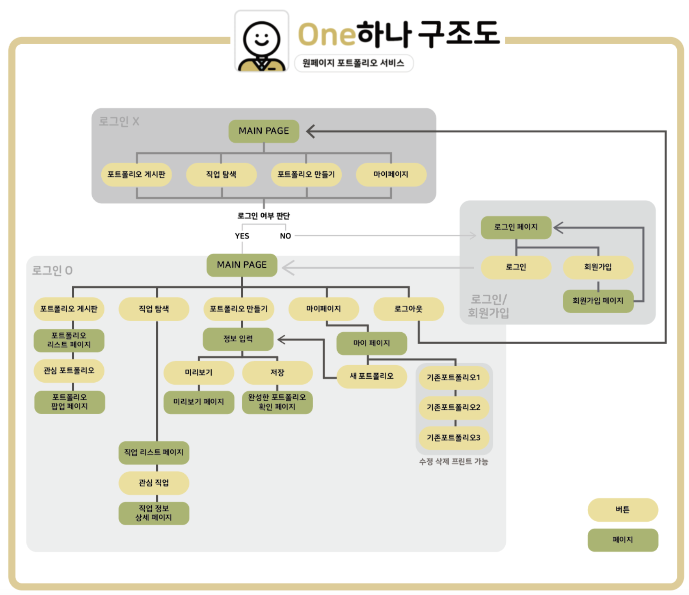
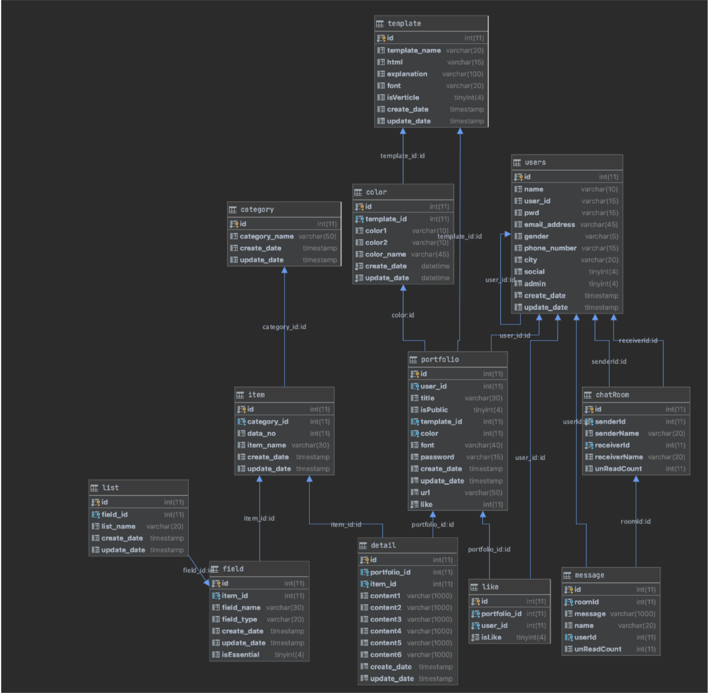

# One 하나

 

This service helps you create a one-page portfolio for the following people.

<!-- [http://walab.handong.edu:8080/wanana/](http://walab.handong.edu:8080/wanana/)
 -->
 
1) A portfolio that satisfies both applicants and recruiters. 
2) A portfolio that can be easily created by those who are new to portfolio creation. 
3) A portfolio that can be configured beautifully even for those who do not have a sense of design.

- <b>One 하나는 포트폴리오 제작, 다른 사용자의 포트폴리오 열람, 직업 정보 탐색이 가능한 웹 서비스 입니다.</b> 포트폴리오 제작에 어려움을 겪는 컴퓨터공학 계열 취업 준비생을 위해, 쉽게 포트폴리오를 제작할 수 있도록 개발하였습니다. 템플릿을 제공하여 디자인에 대한 부담감을 낮춰 A4용지 한 페이지 분량의 포트폴리오를 완성할 수 있습니다. 또한, 포트폴리오 추천 항목을 제공하여 완성도 높은 포트폴리오를 제작하는 데 도움을 주고 있습니다.

- [One 하나 서비스 데모 동영상](https://youtu.be/ovd0nOiKtqA)

## 📱 Function
 1. Create portfolio ( + modify, delete)
 2. Providing url for each portfolio 
 3. Viewing other people's portfolio 
    through the board
 4. Contact the creator of the portfolio
 5. Provide job information
 
 ## 🏆 Awards
- 2020.11 - 2020 한동 SW Festival 스마트 애플리케이션 공모전 **우수상**
- 2021.06 - 제29회 한동대학교 전산전자공학부 캡스톤 페스티벌 ‘캡스톤 디자인 부문' **대상**
 
## 🛠 Stacks
- Spring 4.3.1
- Mybatis 3.4.1
- MariaDB
- JSP, CSS, Javascript

## 🗣 Communication
- Messaging: Kakaotalk
- Code sharing: Github
- Productivity: Notion, Dynalist

## 📂 사용 데이터
워크넷API:::직업정보 API
https://openapi.work.go.kr/opi/opi/opia/jobSrchVw.do

## 🔗 Structure

## 🔍 ERD

